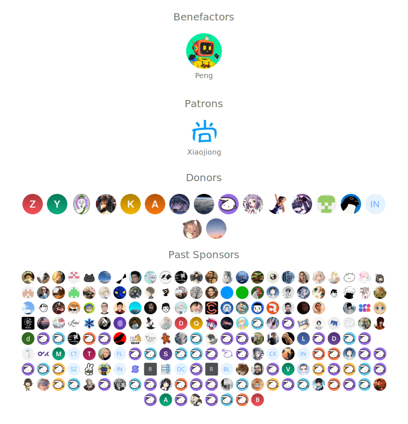

## Sponsors

If my code has helped you, please consider [sponsoring me](https://github.com/sponsors/DIYgod).

### Recurring Donation

-   Become a Sponser on [GitHub](https://github.com/sponsors/DIYgod)
-   Become a Sponser on [Patreon](https://www.patreon.com/DIYgod)
-   Become a Sponser on [Open Collective](https://opencollective.com/rsshub)
-   Become a Sponser on [爱发电](https://afdian.net/@diygod)
-   Contact me directly: [i@diygod.me](mailto:i@diygod.me)

### One-time Donation

-   [WeChat Pay](https://archive.diygod.me/images/wx.jpg)
-   [Alipay](https://archive.diygod.me/images/zfb.jpg)
-   [Paypal](https://www.paypal.me/DIYgod)

Thank you for your support!

  

## Thanks

Built with [SponsorKit](https://github.com/antfu/sponsorkit).